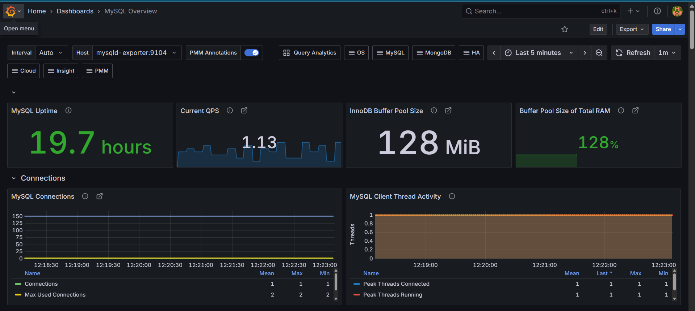
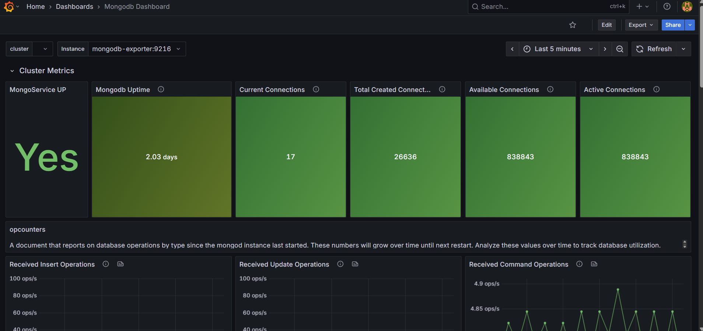
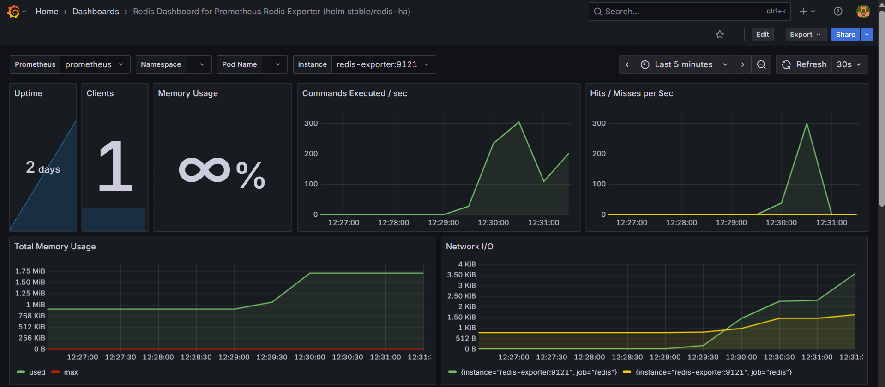

# 📡 Multi-Database Monitoring Stack with Prometheus & Grafana

This project sets up a comprehensive monitoring system for **MySQL**, **MongoDB**, **Redis**, and **host system metrics** using **Prometheus**, **Grafana**, and exporters — all containerized via Docker Compose.

## 🐳 Stack Overview

- ⚙️ Docker Compose-based setup
- 📈 Grafana dashboards for real-time visualization
- 📦 Prometheus to scrape and store metrics
- 📊 Exporters for MySQL, MongoDB, Redis, and system metrics

## 🗃️ Databases Configured

### 🔵 MySQL (Master-Slave Replication)
- MySQL 5.7 containers with replication setup
- Exporter: `mysqld-exporter`

### 🟢 MongoDB (Primary-Secondary Replica Set)
- MongoDB 6.0 with internal authentication and replication
- Exporter: `mongodb-exporter`

### 🔴 Redis
- Standalone Redis instance
- Exporter: `redis-exporter`

### 🖥️ Node (Host Metrics)
- Exporter: `node-exporter` for system-level metrics

## 📊 Metrics Monitored

### ✅ MySQL (via mysqld-exporter)
- Replication lag  
- Uptime  
- Threads & connections  
- Queries per second  

### ✅ MongoDB (via mongodb-exporter)
- Replica set state  
- Memory and connections  
- Operations & cursors  

### ✅ Redis (via redis-exporter)
- Memory usage  
- Keyspace hits/misses  
- Clients, CPU  

### ✅ Host (via node-exporter)
- CPU, Memory, Disk  
- System uptime  
- Network I/O  

## 📂 Project Structure

```plaintext
multi-db-monitoring-stack/
├── docker-compose.yml
├── prometheus/
│   └── prometheus.yml
├── grafana/
│   └── dashboards/
│       └── [custom.json or prebuilt dashboards]
├── mysql/
│   └── master/
│       └── my.cnf
│   └── slave/
│       └── my.cnf
├── mongodb/
│   └── setup.js
├── README.md
```
🚀 Getting Started
# Clone the repo
git clone https://github.com/bhattprerna/multi-db-monitoring-stack.git
cd multi-db-monitoring-stack

# Start services
docker compose up -d

# Access Grafana at:
http://localhost:3000
# Default login: admin / admin

🧩 Grafana Dashboards



📜 License
This project is licensed under the MIT License.

🙋‍♀️ Author
Prerna Bhatt
💼 DevOps Enthusiast | Cloud | Automation
🔗 LinkedIn
📁 More Projects

